## Web Kuliner Sederhana
| **UAS** |  Pemrograman WEB 1  |
|-------|---------
| **NIM**   | 312310632
| **Nama** | FAKHRI AFIF 
| **Kelas** | TI.23.A6
| **Mata Kuliah**    |     Pemrograman WEB 1    |
| **Dosen Pengampu** |Eko Budiarto, S.Kom., M.M.  |

**Perintah UAS:**

- Buatlah sebuah aplikasi CRUD sederhana dengan menggunakan tambahan Bootstrap 5
dan Datatables.

# CRUD: Create, Read, Update, Delete

CRUD adalah singkatan dari **Create, Read, Update, dan Delete**, yang merupakan empat operasi utama dalam pengelolaan data pada aplikasi atau sistem. Konsep ini sering digunakan dalam konteks pengembangan perangkat lunak, khususnya dalam aplikasi yang berbasis basis data. Berikut adalah penjelasan masing-masing operasinya:

## 1. Create (C)
Operasi untuk membuat atau menambahkan data baru ke dalam basis data. Contoh:
- Menambahkan pengguna baru ke dalam sistem.
- Membuat entri baru di tabel produk.

## 2. Read (R)
Operasi untuk membaca atau mengambil data dari basis data. Contoh:
- Menampilkan daftar semua pengguna.
- Melihat rincian produk tertentu.

## 3. Update (U)
Operasi untuk memperbarui atau mengubah data yang sudah ada dalam basis data. Contoh:
- Mengedit informasi pengguna (misalnya, mengubah alamat email).
- Memperbarui harga produk di katalog.

## 4. Delete (D)
Operasi untuk menghapus data dari basis data. Contoh:
- Menghapus akun pengguna yang tidak aktif.
- Menghapus entri produk yang tidak lagi tersedia.

---
CRUD adalah inti dari pengelolaan data pada aplikasi berbasis basis data, baik itu aplikasi web, aplikasi seluler, maupun perangkat lunak lainnya. Implementasi CRUD biasanya dilakukan melalui antarmuka pengguna (UI) atau API menggunakan berbagai teknologi dan bahasa pemrograman.

## Tampilan :

### Halaman Home

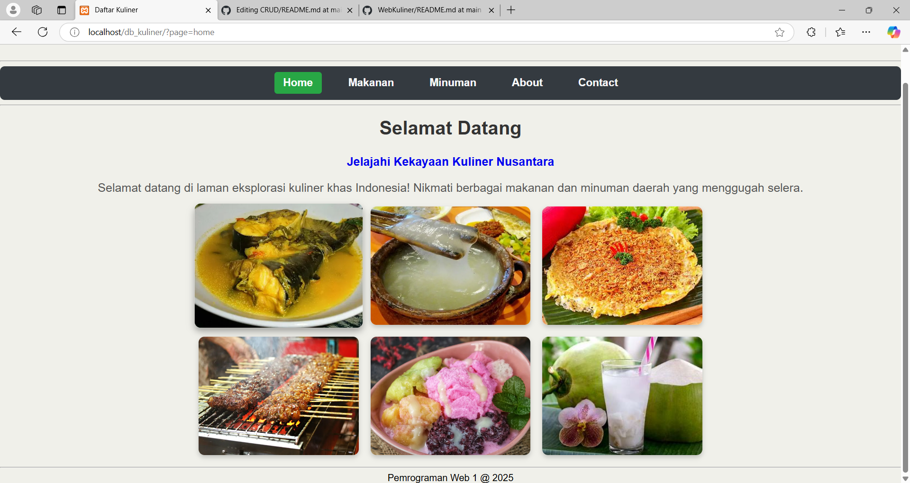

### Halaman Data Makanan

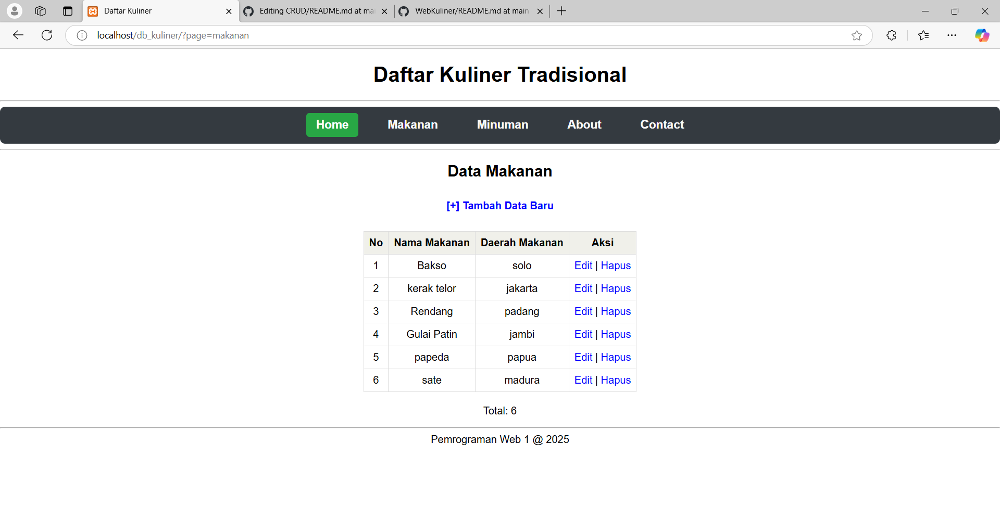

- create data makanan

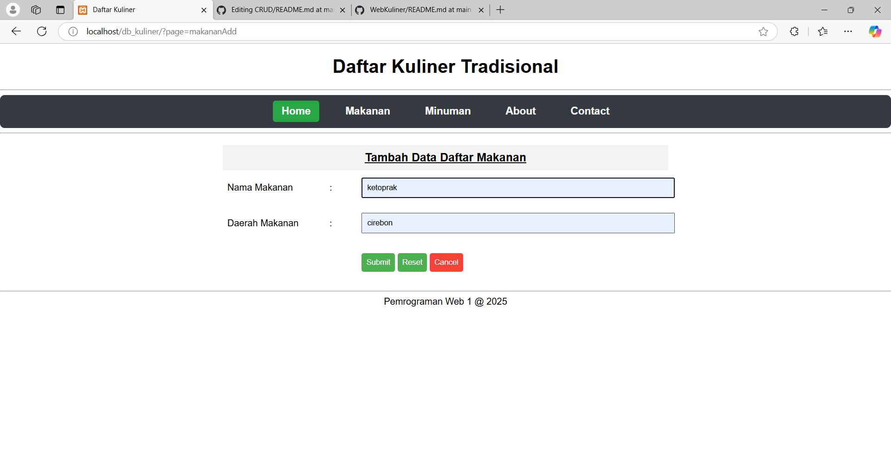

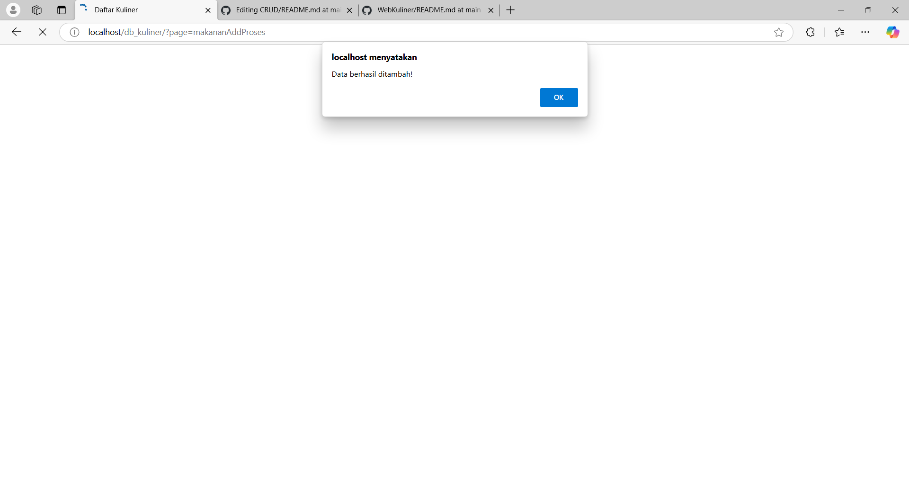

- update data makanan

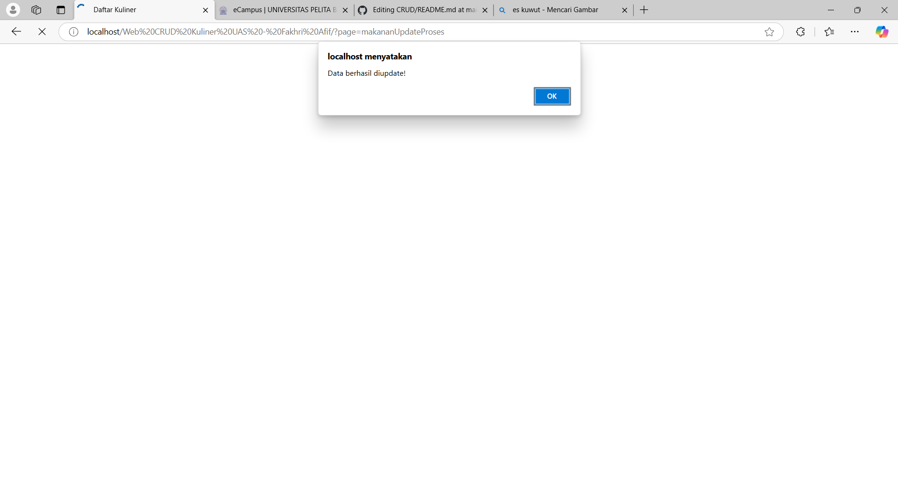

### Halaman Data Minuman
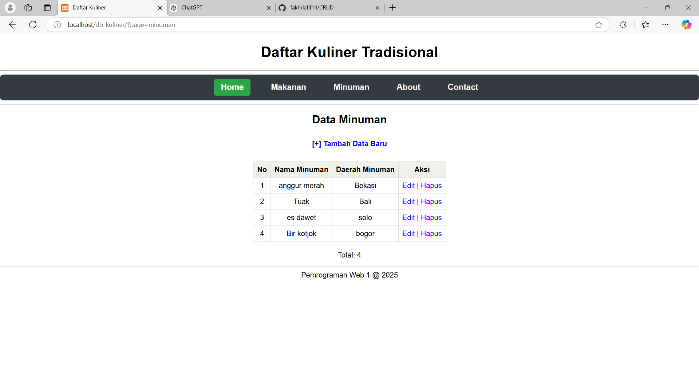

- create Data Minuman
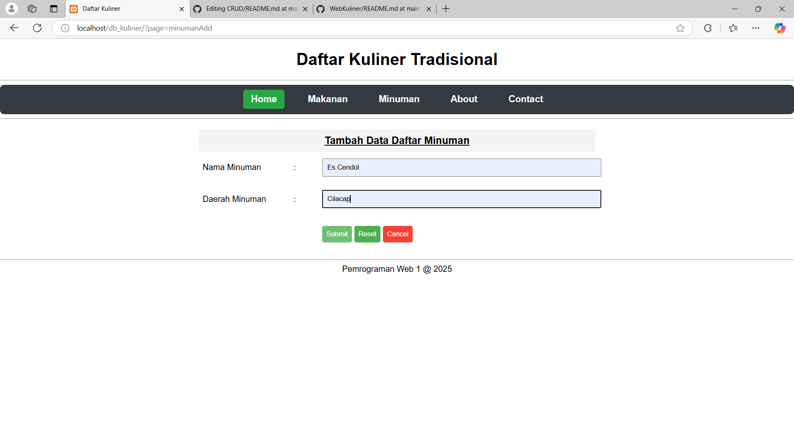

- update Data Minuman
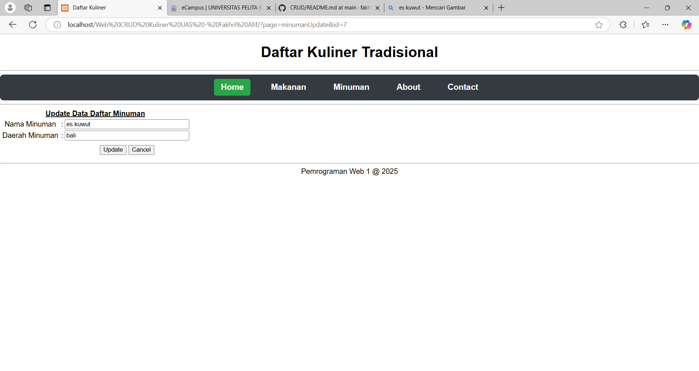

### Delete Data Makanan & Minuman
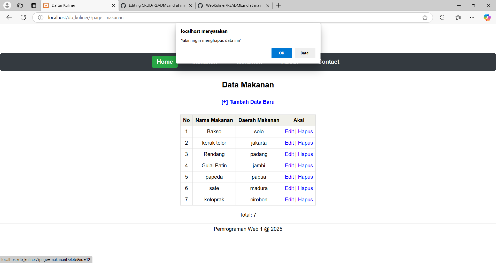
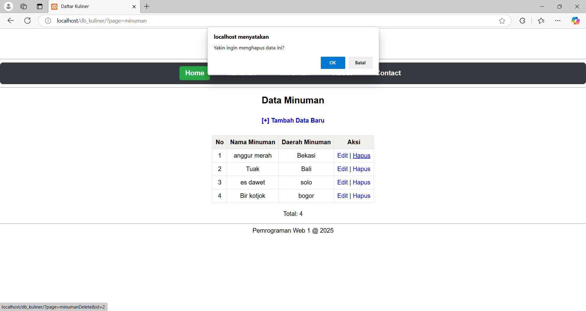

### About

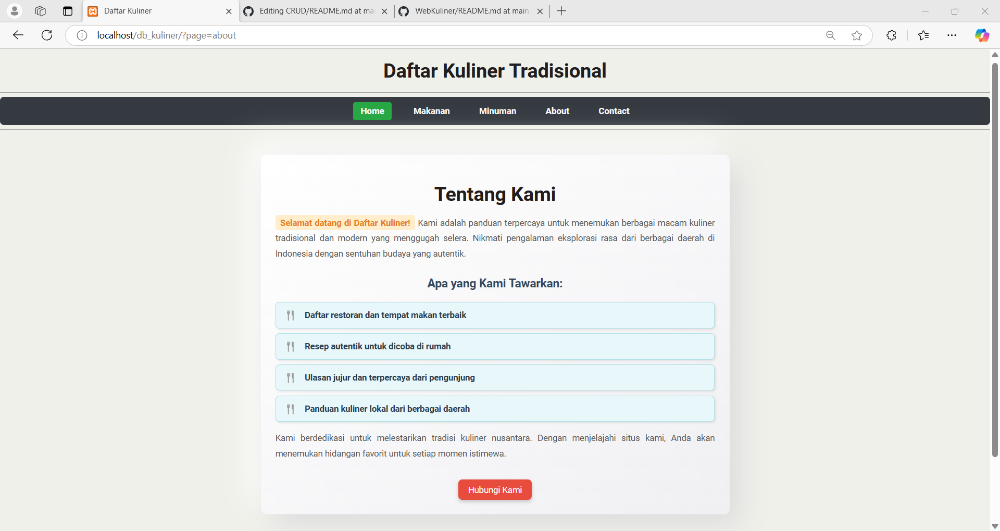

### Contact

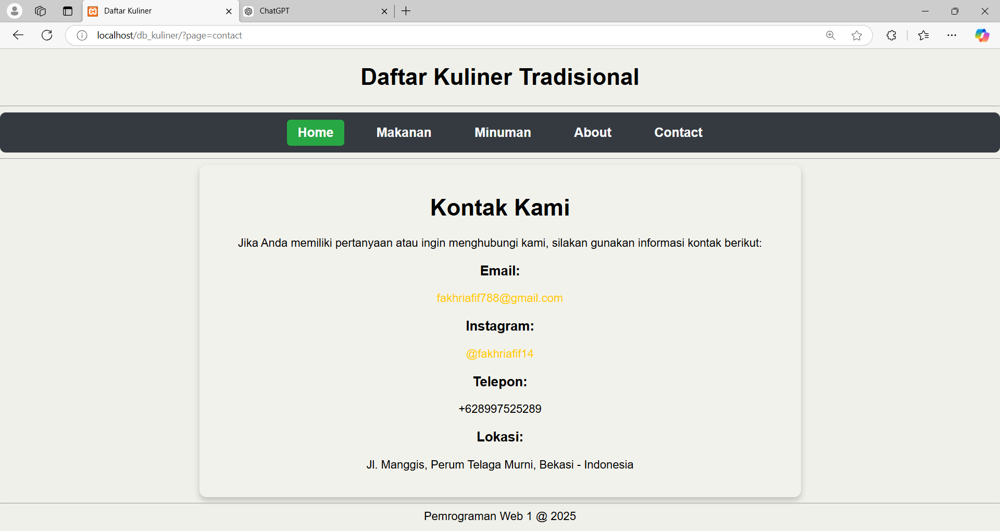

## Selesai
